> 📦 **源代码**: [GitHub 仓库](https://github.com/D2RS-2026spring/RSTUDIO)

# 项目概述

本项目复现发表在 *Nature Communications* 的论文：

**An agricultural digital twin for mandarins demonstrates the potential for individualized agriculture**

- 论文链接：https://www.nature.com/articles/s41467-024-45725-x
- 原始数据：https://github.com/heoseong/Digital_twin 和 https://zenodo.org/records/10531851

## 小组成员

- 徐智强（2025303110028）
- 张清华（2025303110027）
- 张宇翔（2025303110026）
- 王力辉（2025303110040）
- 邱悦欣（2025303120146）

## 可重现性总体评估

论文在数据可用性和代码可用性部分提供了详细的信息。所有原始数据（土壤化学性质、果实品质、天气、农业实践）已存放在 GitHub 和 Zenodo 中，并可通过开放 API 获取。分析代码使用 R 语言编写，依赖多个 R 包（如 dplyr, ggplot2, terra, h2o, lme4 等）。

# 复现结果

## Figure 2 — 济州岛果园土壤化学性质核密度估计

包含 7 个子图（A–G），分别展示有效磷、交换性钾、交换性钙、交换性镁、pH、有机质、电导率的空间分布。

::: {layout-ncol=1}
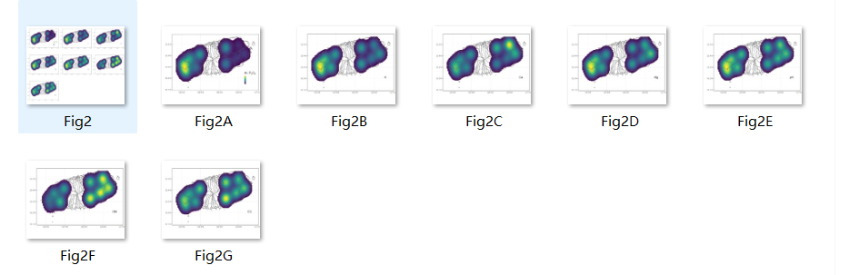
:::

## Figure 3 — 糖度和果实大小的时空变化

地图上每个点代表一个果园，点的大小表示平均果实大小，颜色深浅表示平均糖度。分三个时间段展示。

::: {layout-ncol=3}
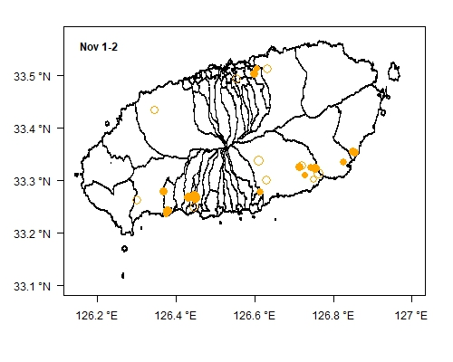
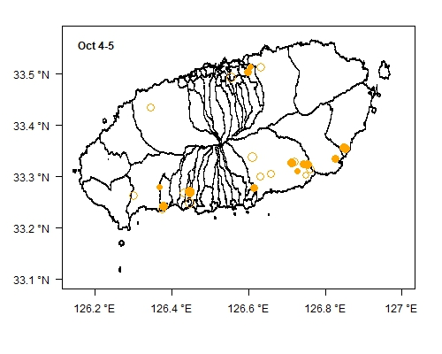
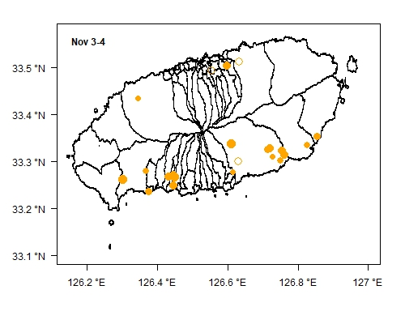
:::

## Figure 4 — 糖度和果实大小与土壤及气象因素的平均趋势

使用平滑样条展示糖度（°Brix）和果实大小（mm）随土壤化学性质和气象因素变化的趋势。

::: {layout-ncol=5}
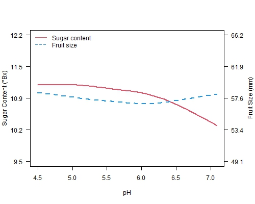
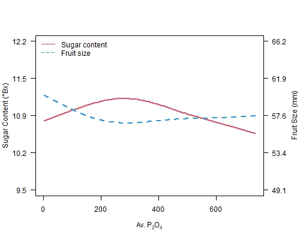
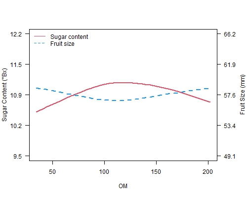
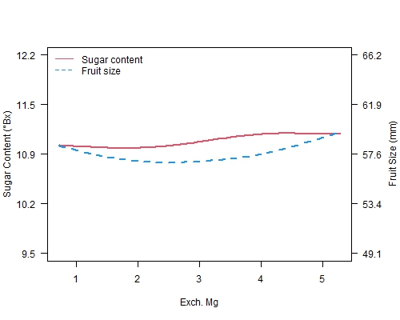
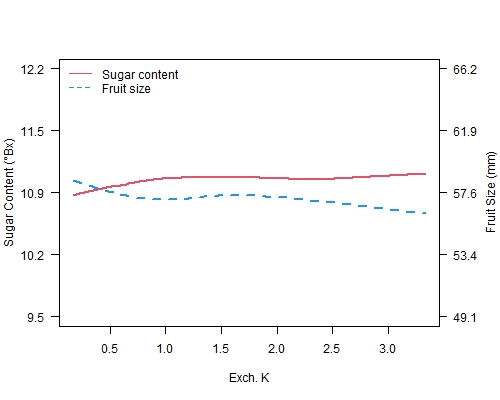
:::

::: {layout-ncol=5}
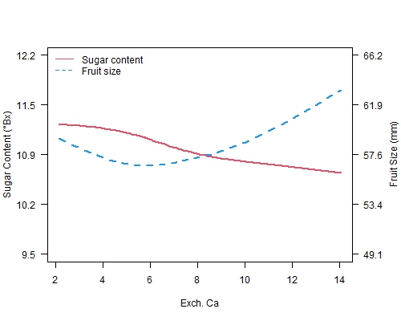
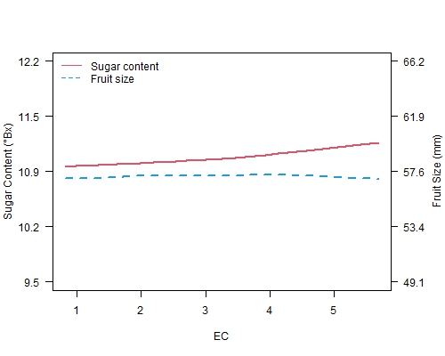
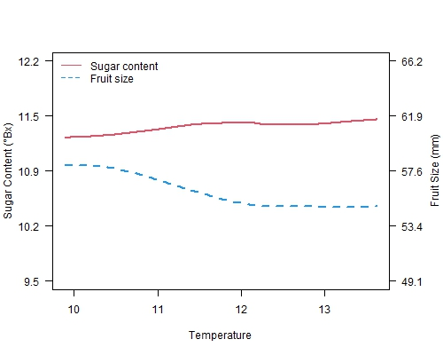
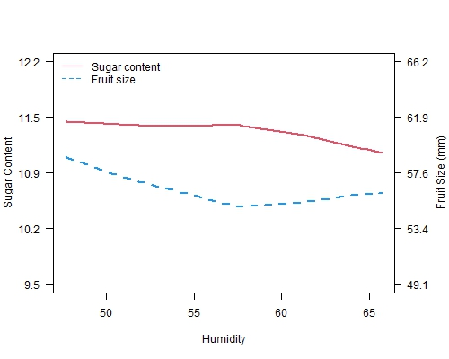
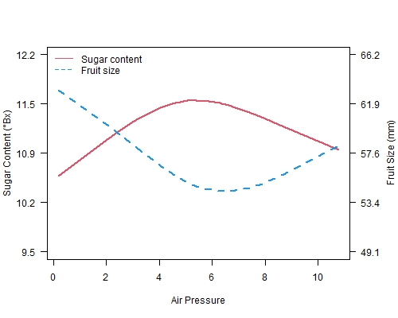
:::

## Figure 5 — 两个果园（Hab 和 lab）的对比

::: {layout-ncol=2}
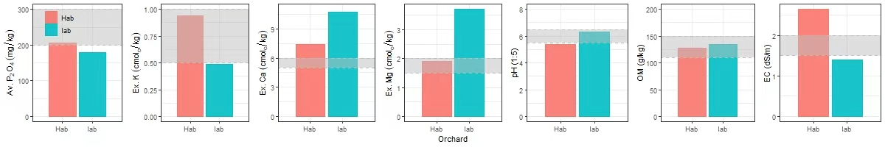
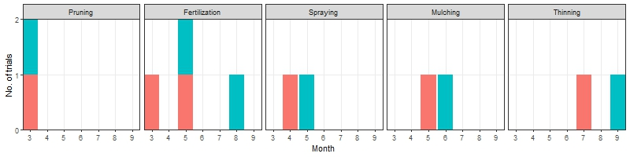
:::

::: {layout-ncol=2}
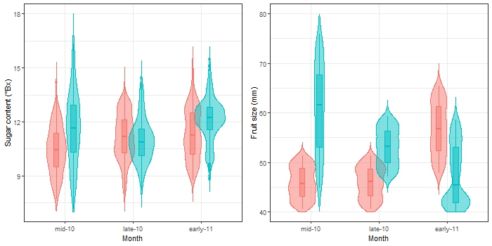
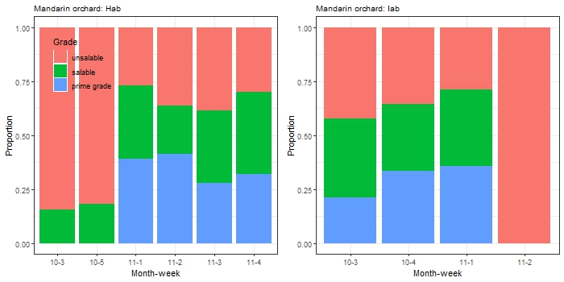
:::

## Figure 6 — 各果园糖度和果实大小的分布

::: {layout-ncol=2}
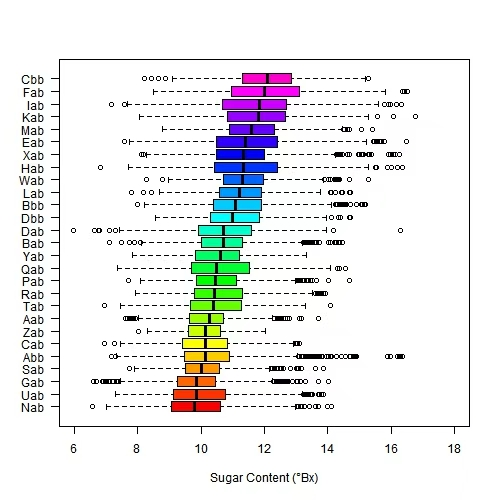
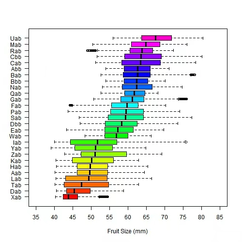
:::

## Figure 8 — 果园内部分析（lab 果园）

::: {layout-ncol=2}
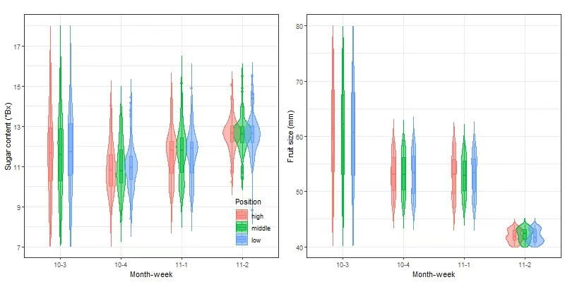
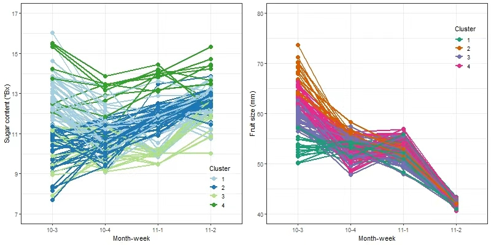
:::

## Figure 9 — 果园间 vs 果园内模型预测能力对比

::: {layout-ncol=2}
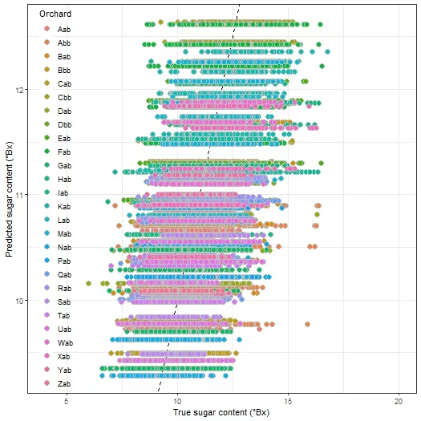
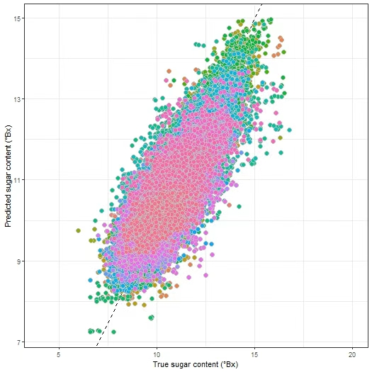
:::

# 各图重现难度评估

| 图号 | 内容 | 重现难度 |
|------|------|----------|
| Figure 1 | 农业数字孪生概念示意图 | 不易（概念图，需手工绘制） |
| Figure 2 | 土壤化学性质核密度估计 | 中等（需 GIS 地图数据） |
| Figure 3 | 糖度和果实大小时空变化 | 中等（需地图背景数据） |
| Figure 4 | 糖度和果实大小趋势 | 容易（数据已提供） |
| Figure 5 | 两个果园对比 | 容易（数据已提供） |
| Figure 6 | 各果园分布 | 容易（数据已提供） |
| Figure 8 | 果园内部分析 | 容易（数据已提供） |
| Figure 9 | 模型预测能力对比 | 容易（数据已提供） |

# 代码说明

项目包含以下 R 脚本，用于生成各图：

- `Fig_02.R` — Figure 2 核密度估计
- `Fig_03.R` — Figure 3 时空变化图
- `Fig_04.R` — Figure 4 趋势图
- `Fig_05A.R` ~ `Fig_05D.R` — Figure 5 各子图
- `Fig_06.R` — Figure 6 箱线图
- `Fig_08A.R` ~ `Fig_08B.R` — Figure 8 聚类分析
- `Fig_09.R` — Figure 9 模型对比

# 局限性

1. R 脚本依赖外部数据文件（如 `06_geodataframe.rdata`、`Jeju_shp/jeju.shp`），这些文件未包含在仓库中
2. 地图数据来源于韩国国家空间数据基础设施门户（NSDIP），可能受地区限制
3. 部分包（如 h2o）需要 Java 环境支持
